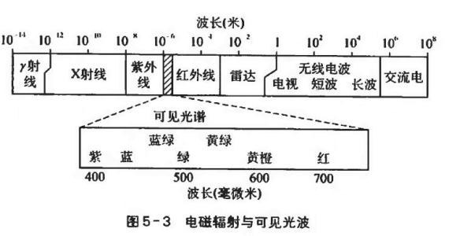
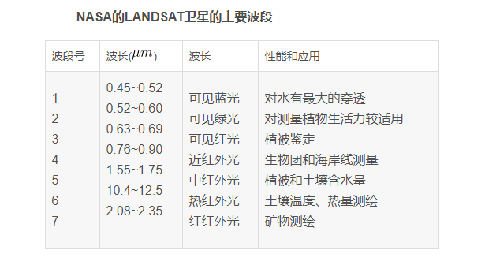
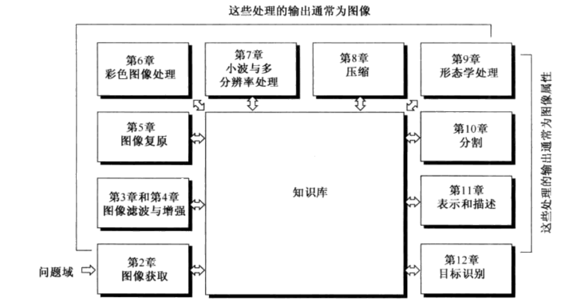

# 第一章 绪论
## 1、数字图像处理
### 数字图像：
一幅图像可定义为一个二维函数f(x,y),当x,y和灰度值f(x,y)是有限的离散值时，我们称该图像为数字图像。
### 数字图像处理：
借助数学计算机来处理数字图像
### 图像的低级处理：
初级操作，例如降噪、对比度增强、图像锐化。低级处理的输入、输出都是图像为特征。
### 图像的中级处理
图像分割等，以输入为图像，输出是从图像中提取的特征（边缘、轮廓、各物体的标识等）
### 图像的高级操作
“理解”已识别的目标总体
## 2、图像处理实例
### 电磁波谱

## 3、数字图像的基本步骤

